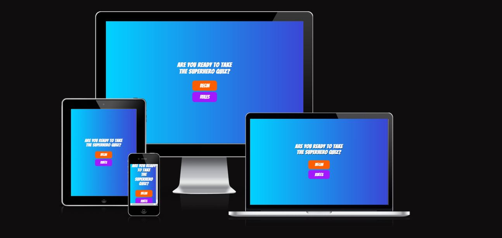
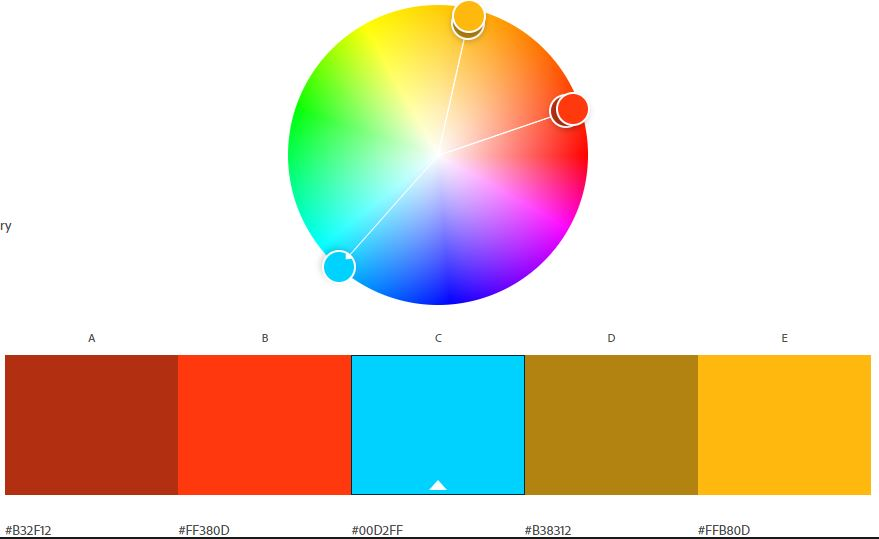
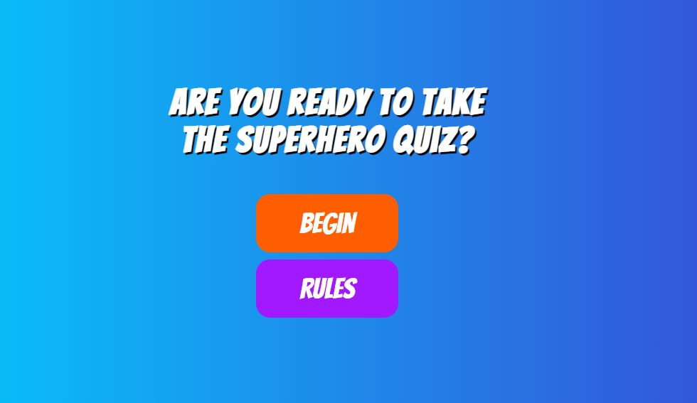
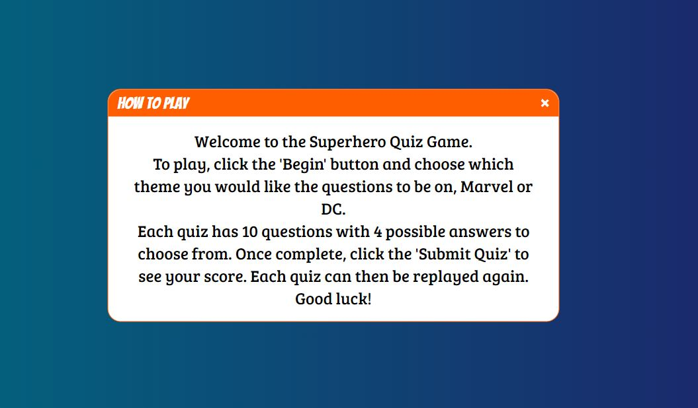
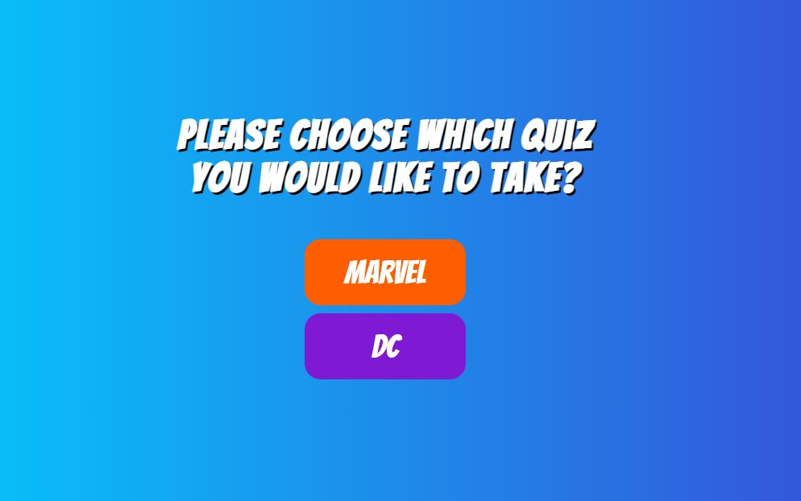
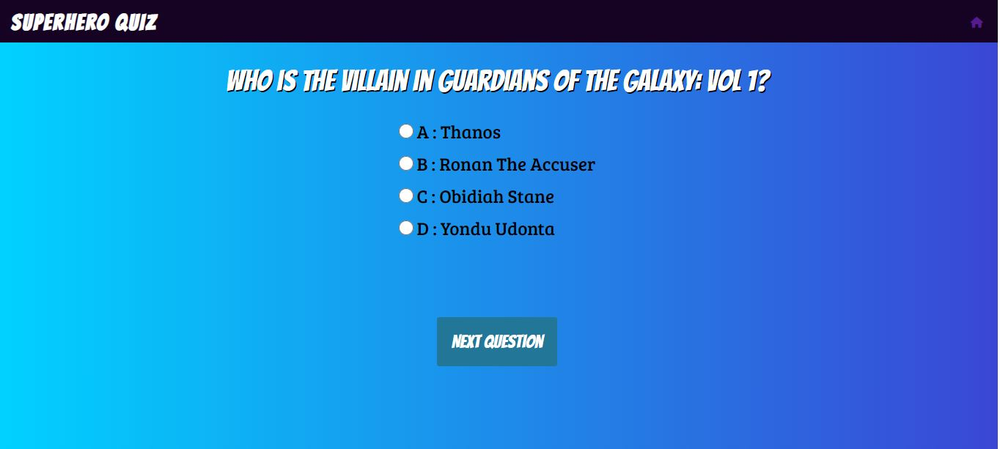
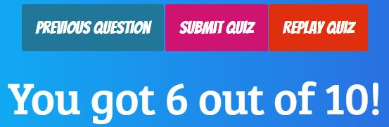
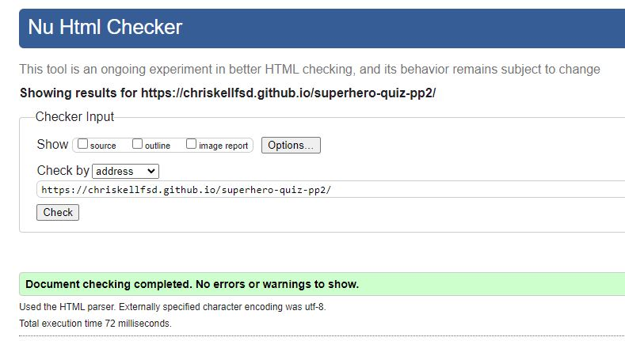
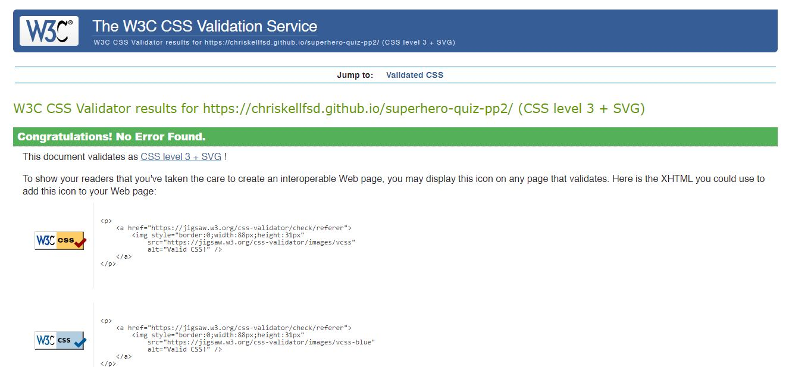
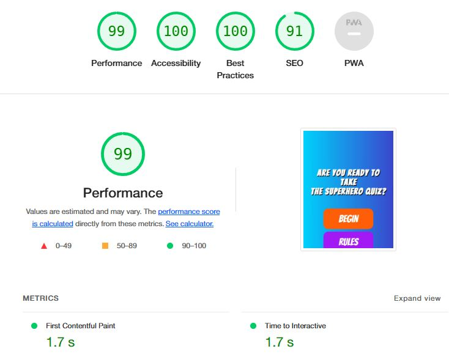

# Superhero Quiz Game
  

This is a quiz game I created under the theme of 'Superhero'. It offers two question sets for both Marvel and DC comics, both of whom are the biggest producers of comics in the world. It lets the user play a multiple choice question quiz, with replayability.

---
## UX
   This quiz game was designed in a way that is very favourable on the ux side as it has minimal buttons to chose from. The buttons on offer are well contrasted and clearly labeled for the user to interact with.

  **Colour Scheme**

   I used Adobe Color to pick my colour scheme for this project. Bright, saturated colours are generally associated with comics and superhero themes and I wanted that reflected in this project.
    

  **Typography**

   The fonts I used for this was 'Bangers' for the main headings and 'Bree Serif' for the body of text.

   Fonts were downloaded from https://fonts.google.com/

   I also used a home icon on the main quiz pages.

   Icons were used from https://fontawesome.com/

   --- 

## Existing Features
**Number of pages**
* This game has 4 main html pages; index, theme, dc and marvel quiz pages.

**Homepage**
   * The home page presents the user with a colourful site with a question asking the user are they ready to play the quiz and two buttons that they can click on.
   

**Rules of the Game**
 * This was done using a javascript popup modal box instead of creating a seperate page just for the rules. It keeps the user on the homepage while explaining clearly the rules of the game.
 

**Quiz Choice**
 * This page was done to give the user some replayability with the quiz game. It gives two quiz options that the user can pick based on their preference.
 

**Quiz Game**
 * This is one of the quiz games to choose from and is the same as the second game. It clearly asks the user a question and gives 4 possible answers. Once the user clicks an answer, they click on Next question to move on. After this is done they can also click on Previous question to change their selection.
 

**Buttons to navigate through the answers**
 * As mentioned, there are a number of buttons that help the user navigate through the quiz. As well as the next and previous buttons, the user has a button to submit the quiz and another to replay the quiz.
 

**Quiz result**
 * Once the user clicks on submit quiz, they are shown their score out of 10 below.
 

**Home icon**
 * If at any point, the user would like the return to the home screen, they can click on the recognisable home icon on the top right hand side of the page.
  
 

 ## Future Features
 * Throughout this project, I tried to implement a couple of features that sadly, I couldn't complete in the project time frame. They are the inclusion of progress bar, a timer which tracks how long the user takes to complete the quiz, and a function to take 10 random questions from an array of 30 questions for each game to keep it fresh for the user.

   ---

## Testing

* I tested that this website works in different browsers: Chrome, Firefox, Safari
* I confirmed that this project is responsive on various screen sizes using chrome developer tools.
* I confirmed that all the text is easily read and the contrast of the website is clear.

**Validators**
* The html was validated with Nu HTML Checker.

* CSS was validated using W3C CSS Validator.

* Lighthouse was used in chrome dev tools to assess its varying perfomance indicators.

* I ran my javascript code through JSHint with no errors.

   ---

## Technologies used
   * HTML
   * CSS
   * Javascript
   * Adobe Illustrator
   * Adobe Photoshop
   * Google Fonts
   * Font Awesome

   ---

## Deployment
  * The site was deployed to GitHub pages by using the following steps:
    * In the GitHub repository, navigate over to the settings tab
    * From there, click on the 'Pages' tab.
    * Then click on the source section and select the Master Branch.
    * Once you have clicked on Master Branch, a live link of the website will be provided for you.

  * You can find the link to the live website here: https://chriskellfsd.github.io/superhero-quiz-pp2/

---

# Bugs

 * I had a bug that when I deployed my site it originally wouldn't work. The buttons onto the next pages did not work, I discovered this was because I had used absolute file paths in my code. Removing the '/' solved the problem.

---

   ## Credits

   **Content**
   * I used the following tutorial to help with my creation of the quiz game: https://www.sitepoint.com/simple-javascript-quiz/
   * Code for the popup box was adapted from following this tutorial: https://www.youtube.com/watch?v=MBaw_6cPmAw&t=192s
   * Watching youtube videos of Web Dev Simplified and Brian Designs helped with aspects of the project

   ---

   **Acknowledgements**
   * I would like to thank <a href="https://github.com/10xOXR">Chris Quinn</a> for helping me throughout this project. His guide and insight helped me greatly along the way and it is very much appreciated.
   